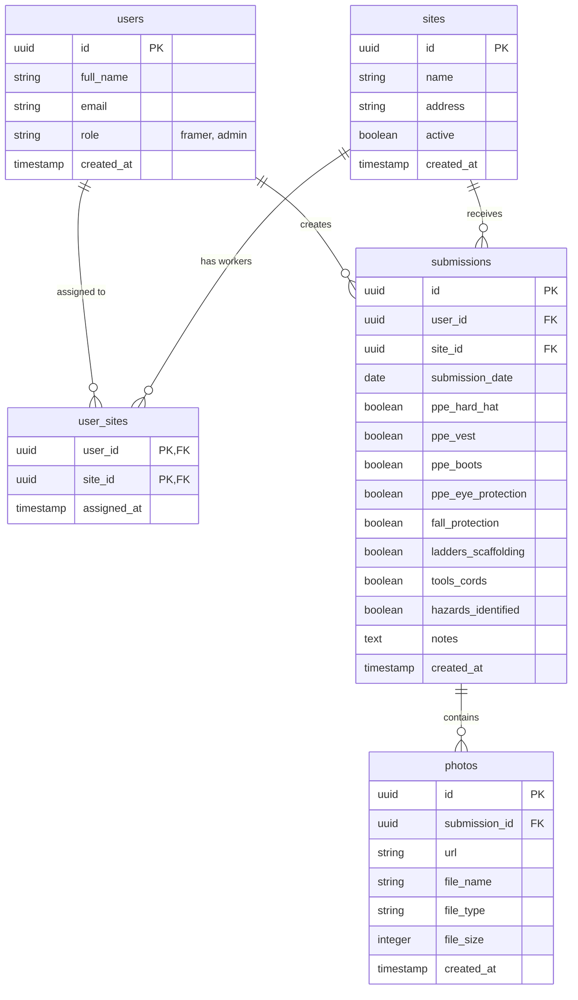

# Entity-Relationship Diagram (ERD)

This document outlines the relational data model for the **Site Safety Forms** application, hosted on PostgreSQL (via Supabase).

---

## Visual ERD



---

## Data Dictionary

### 1. `users`
Mirrors Supabase `auth.users` with application-specific profile data and role-based permissions.

| Column | Type | Constraints | Description |
| :--- | :--- | :--- | :--- |
| `id` | `UUID` | `PRIMARY KEY`, `REFERENCES auth.users(id) ON DELETE CASCADE` | Unique user identifier synced with Supabase Auth |
| `email` | `VARCHAR(255)` | `NOT NULL`, `UNIQUE` | User's work email address |
| `full_name` | `VARCHAR(255)` | `NOT NULL` | Worker's full display name |
| `role` | `VARCHAR(50)` | `NOT NULL`, `CHECK (role IN ('framer', 'admin'))` | Access tier (`admin` or `framer`) |
| `created_at` | `TIMESTAMPTZ` | `DEFAULT NOW()` | Profile creation timestamp |

---

### 2. `sites`
Represents physical construction job sites.

| Column | Type | Constraints | Description |
| :--- | :--- | :--- | :--- |
| `id` | `UUID` | `PRIMARY KEY`, `DEFAULT uuid_generate_v4()` | Unique site identifier |
| `name` | `VARCHAR(255)` | `NOT NULL` | Project or development name (e.g. *Oakridge Residential*) |
| `address` | `VARCHAR(255)` | `NOT NULL` | Physical job site street address |
| `active` | `BOOLEAN` | `NOT NULL`, `DEFAULT TRUE` | Whether the site is active for new submissions |
| `created_at` | `TIMESTAMPTZ` | `DEFAULT NOW()` | Site registration timestamp |

---

### 3. `user_sites` (Junction Table)
Associates workers with assigned sites to calculate missing daily submissions.

| Column | Type | Constraints | Description |
| :--- | :--- | :--- | :--- |
| `user_id` | `UUID` | `PK`, `FK REFERENCES users(id) ON DELETE CASCADE` | Worker assigned to site |
| `site_id` | `UUID` | `PK`, `FK REFERENCES sites(id) ON DELETE CASCADE` | Assigned construction site |
| `assigned_at` | `TIMESTAMPTZ` | `DEFAULT NOW()` | Assignment timestamp |

* **Composite Primary Key:** `(user_id, site_id)` guarantees a worker is assigned to a specific site at most once.

---

### 4. `submissions`
The primary daily safety inspection form submitted by workers.

| Column | Type | Constraints | Description |
| :--- | :--- | :--- | :--- |
| `id` | `UUID` | `PRIMARY KEY`, `DEFAULT uuid_generate_v4()` | Unique submission identifier |
| `user_id` | `UUID` | `NOT NULL`, `FK REFERENCES users(id) ON DELETE CASCADE` | Submitting worker |
| `site_id` | `UUID` | `NOT NULL`, `FK REFERENCES sites(id) ON DELETE RESTRICT` | Job site being inspected |
| `submission_date` | `DATE` | `NOT NULL`, `DEFAULT CURRENT_DATE` | Calendar date of inspection (used for date filtering) |
| `ppe_hard_hat` | `BOOLEAN` | `NOT NULL`, `DEFAULT FALSE` | Hard hat verified |
| `ppe_vest` | `BOOLEAN` | `NOT NULL`, `DEFAULT FALSE` | High-vis vest verified |
| `ppe_boots` | `BOOLEAN` | `NOT NULL`, `DEFAULT FALSE` | Steel-toe boots verified |
| `ppe_eye_protection` | `BOOLEAN` | `NOT NULL`, `DEFAULT FALSE` | Eye protection verified |
| `fall_protection` | `BOOLEAN` | `NOT NULL`, `DEFAULT FALSE` | Fall protection in place |
| `ladders_scaffolding` | `BOOLEAN` | `NOT NULL`, `DEFAULT FALSE` | Ladders and scaffolding secure |
| `tools_cords` | `BOOLEAN` | `NOT NULL`, `DEFAULT FALSE` | Tools and electrical cords safe |
| `hazards_identified` | `BOOLEAN` | `NOT NULL`, `DEFAULT FALSE` | Site verified free of undocumented hazards |
| `notes` | `TEXT` | `NULLABLE` | Explanation of identified hazards or general remarks |
| `created_at` | `TIMESTAMPTZ` | `DEFAULT NOW()` | Exact submission timestamp |

* *Note:* `all_safe` is computed dynamically in the API layer: `true` if all 8 boolean checklist toggles are `true`.

---

### 5. `photos`
Evidence photographs uploaded by workers during safety assessments.

| Column | Type | Constraints | Description |
| :--- | :--- | :--- | :--- |
| `id` | `UUID` | `PRIMARY KEY`, `DEFAULT uuid_generate_v4()` | Unique photo identifier |
| `submission_id` | `UUID` | `NOT NULL`, `FK REFERENCES submissions(id) ON DELETE CASCADE` | Associated safety submission |
| `url` | `VARCHAR(1000)` | `NOT NULL` | Public URL in Supabase Storage (`safety-photos` bucket) |
| `file_name` | `VARCHAR(255)` | `NOT NULL` | Original client file name |
| `file_type` | `VARCHAR(100)` | `NOT NULL` | MIME type (e.g., `image/jpeg`, `image/png`) |
| `file_size` | `INTEGER` | `NOT NULL` | File size in bytes |
| `created_at` | `TIMESTAMPTZ` | `DEFAULT NOW()` | Upload timestamp |

---

## Relational Cardinality & Integrity

| Relationship | Cardinality | Cascade Action | Business Rule |
| :--- | :--- | :--- | :--- |
| `users` ➔ `submissions` | One-to-Many (`1 : N`) | `ON DELETE CASCADE` | Deleting a user removes their historical submissions. |
| `sites` ➔ `submissions` | One-to-Many (`1 : N`) | `ON DELETE RESTRICT` | Active sites with existing audit submissions cannot be deleted accidentally. |
| `users` ➔ `user_sites` ➔ `sites` | Many-to-Many (`M : N`) | `ON DELETE CASCADE` | Workers can be assigned to multiple sites; sites have multiple workers. |
| `submissions` ➔ `photos` | One-to-Many (`1 : N`) | `ON DELETE CASCADE` | Deleting a submission cascades and removes all attached photos. |

---

## Database Performance Indexes

To support rapid filtering on high-volume tables, the following indexes are maintained:

```sql
CREATE INDEX idx_submissions_user_date ON public.submissions(user_id, submission_date);
CREATE INDEX idx_submissions_site_date ON public.submissions(site_id, submission_date);
CREATE INDEX idx_submissions_date ON public.submissions(submission_date);
CREATE INDEX idx_photos_submission ON public.photos(submission_id);
CREATE INDEX idx_users_role ON public.users(role);
```
