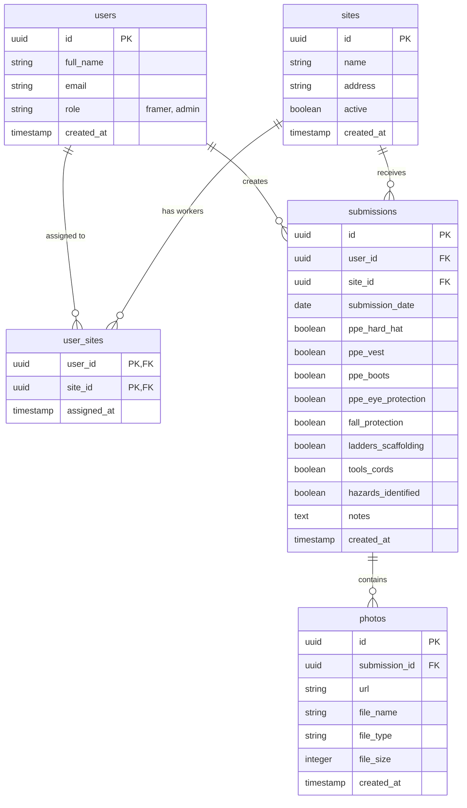

# Entity-Relationship Diagram (ERD)

This diagram outlines the relational data model for the Site Safety Forms application, hosted on PostgreSQL (via Supabase).

```mermaid
erDiagram
    users {
        uuid id PK
        string full_name
        string email
        string role "framer, admin"
        timestamp created_at
    }

    sites {
        uuid id PK
        string name
        string address
        boolean active
        timestamp created_at
    }

    user_sites {
        uuid user_id PK, FK
        uuid site_id PK, FK
        timestamp assigned_at
    }

    submissions {
        uuid id PK
        uuid user_id FK
        uuid site_id FK
        date submission_date
        boolean ppe_hard_hat
        boolean ppe_vest
        boolean ppe_boots
        boolean ppe_eye_protection
        boolean fall_protection
        boolean ladders_scaffolding
        boolean tools_cords
        boolean hazards_identified
        text notes
        timestamp created_at
    }

    photos {
        uuid id PK
        uuid submission_id FK
        string url
        string file_name
        string file_type
        integer file_size
        timestamp created_at
    }

    %% Relationships
    users ||--o{ submissions : "creates"
    sites ||--o{ submissions : "receives"
    users ||--o{ user_sites : "assigned to"
    sites ||--o{ user_sites : "has workers"
    submissions ||--o{ photos : "contains"
```
